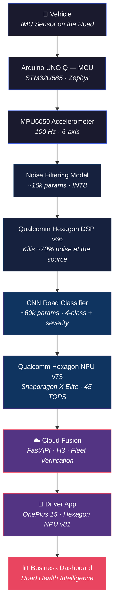
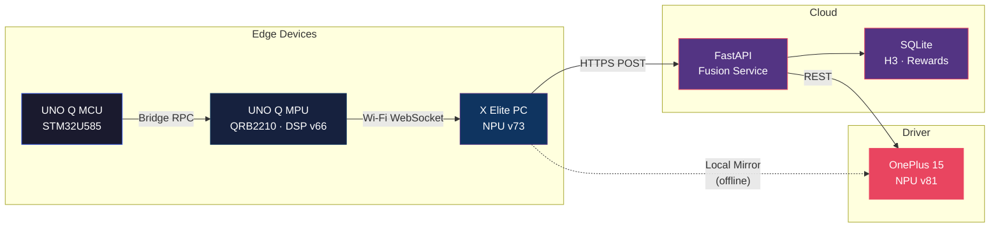
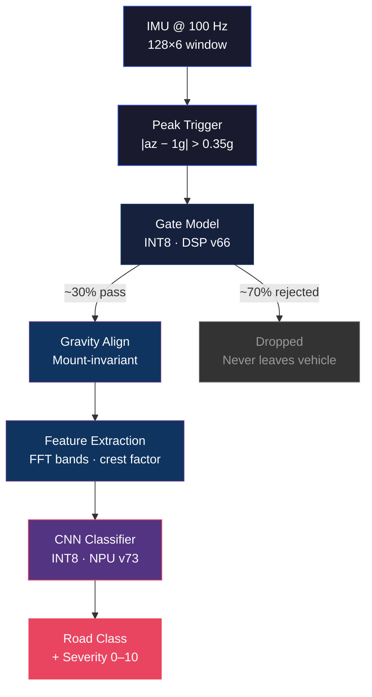
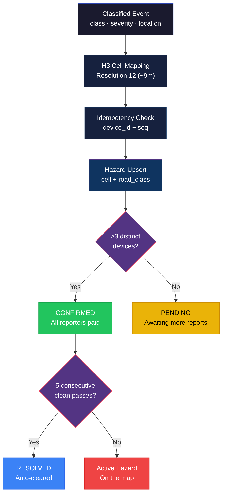
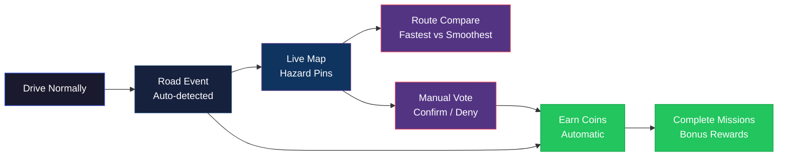
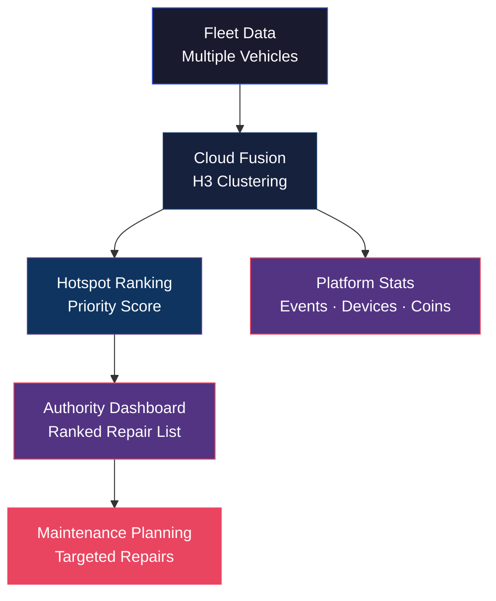

<p align="center">
  
</p>

<h1 align="center">RoadSense AI</h1>

<p align="center">
  <strong>Turn every vehicle into an intelligent road sensor.</strong><br>
  Edge AI detects potholes, speed breakers, and rough patches in real time —<br>
  rewarding drivers while giving cities a live road health dashboard.
</p>

<p align="center">
  <a href="#the-problem">Problem</a> · <a href="#how-it-works">How It Works</a> · <a href="#driver-experience">Driver App</a> · <a href="#ai-pc-dashboard">Dashboard</a> · <a href="#getting-started">Get Started</a> · <a href="ARCHITECTURE.md">Architecture</a> · <a href="API_DOCUMENTATION.md">API Docs</a> · <a href="BENCHMARKS.md">Benchmarks</a>
</p>

<p align="center">
  
  
  
  
</p>

---

## The Problem

Roads deteriorate silently. Cities react to complaints instead of data. Drivers discover potholes the hard way. Manual road surveys are slow, expensive, and outdated before they're published.

**RoadSense AI** solves this by transforming vehicles already on the road into a distributed sensor network. An embedded IMU detects road damage in real time. AI classifies it on-device. The cloud fuses reports across the fleet. Drivers get rewarded. Cities get actionable intelligence.

> Think **Google Maps** (navigation) + **Waze** (crowd verification) + **Sweatcoin** (driver incentives) — running majority-on-edge across five Snapdragon compute domains.

---

## How It Works

Every road event travels through a **5-hop edge AI pipeline** — from sensor to driver screen — touching five Snapdragon compute domains.



### Why five hops?

Each device exists because no single chip can do the full job.

| Hop | Device | Chip | Why It's Necessary |
|:---:|--------|------|--------------------|
| 1 | Arduino UNO Q — MCU | STM32U585 (Zephyr) | Only chip with deterministic 100 Hz timing — Linux can't guarantee it |
| 2 | Arduino UNO Q — MPU | QRB2210 (Hexagon DSP v66) | Kills ~70% of noise at the source. Raw signal never leaves the vehicle (privacy) |
| 3 | Snapdragon X Elite PC | Hexagon NPU v73 (45 TOPS) | Full 4-class road classifier + severity regression. Edge-first local mirror |
| 4 | Cloud | FastAPI | Cross-vehicle fleet fusion is impossible on any single device |
| 5 | OnePlus 15 Phone | Hexagon NPU v81 | The only device with the driver — map, routes, voice alerts, rewards |

---

## The AI — Simply Explained

RoadSense uses **two AI models** working in sequence, both running entirely on-device.

### Model 1 — The Noise Filter (Gate)

The first model acts as a gatekeeper. It examines every vibration captured by the sensor and asks one question: *"Is this a real road event, or just normal driving?"*

- Removes ~70% of unnecessary sensor readings at the source
- Only meaningful road events continue to the next stage
- Runs on the **Qualcomm Hexagon DSP** (INT8, ~10k parameters)
- Privacy by design — rejected data never leaves the vehicle

### Model 2 — The Road Classifier

The second model examines the surviving vibration patterns and predicts what the vehicle just drove over:

| Class | What It Detects |
|-------|-----------------|
| **Smooth Road** | Normal, well-maintained road surface |
| **Pothole** | Sharp vertical impact — a localized depression in the road |
| **Speed Breaker** | Slow, symmetric hump — a deliberate raised section |
| **Rough Patch** | Sustained vibration — a section of deteriorated road surface |

- 4-class classification + continuous severity score (0–10)
- Speed-normalized — the same bump at highway speed doesn't inflate the score
- Vehicle-calibrated — adjusts for 2-wheelers, hatchbacks, and SUVs
- Runs on the **Qualcomm Hexagon NPU** (INT8, ~60k parameters)
- Inference is **fast, efficient, and low-latency** — true edge AI

> Both models use only Conv1D, BatchNorm, ReLU, and Dense layers — deliberately simple architectures that guarantee full Hexagon op coverage without silent CPU fallback.

---

## Driver Experience

### RoadSense Rewards

Drivers aren't just users — they're contributors. Every drive automatically earns **RoadSense Coins** for mapping road conditions.

| Action | Coins Earned |
|--------|:------------:|
| First vehicle to map an unmapped road cell | **10** |
| Each reporter when a hazard is crowd-confirmed (≥3 devices) | **5** |
| Manual vote matching the confirmed outcome | **2** |
| Mission: Map 5 unmapped cells | **50** |
| Mission: Map 25 unmapped cells | **200** |
| Mission: Help confirm 3 hazards | **30** |
| Mission: Report your first hazard | **15** |

Rewards are backed by an **append-only ledger** with idempotency keys — offline sync replays can never double-pay. Balances are derived, never mutated.

<p align="center">
  
</p>

### Fastest vs Smoothest Navigation

Enter a start and destination. RoadSense compares two routes:

| | Fastest Route | Smoothest Route |
|---|---|---|
| **Priority** | Shortest travel time | Fewest road hazards |
| **Trade-off** | May pass through potholes and rough patches | May add a few minutes |
| **Best for** | Time-sensitive trips | Comfort, vehicle care, safety |

> The smoothest path may not always be the shortest. It avoids confirmed potholes, rough patches, and high-severity hazards — giving you a choice between speed and comfort.

<p align="center">
  
</p>

---

## AI PC Dashboard

The Snapdragon X Elite hosts a real-time hop-visualizer dashboard that gives operators and judges a live window into the entire pipeline.

### H3 Hexagon Road Intelligence

Road hazards are grouped using **H3 hexagonal spatial indexing** at resolution 12 (~9 meter cells). This creates a clean, uniform grid where:

- Higher-severity areas become visually obvious through color intensity
- Each hexagon aggregates reports from multiple vehicles
- Clicking a hexagon opens detailed hazard information
- The grid self-maintains — 5 consecutive clean passes auto-resolve a hazard

<p align="center">
  
</p>

### Road Condition Details

Selecting a hexagon reveals a detailed popup with:

| Field | Description |
|-------|-------------|
| **Severity** | Mean severity score (0–10) across all reports |
| **Confidence** | Number of distinct devices that reported this hazard |
| **Road Type** | Classification — pothole, speed breaker, or rough patch |
| **Status** | PENDING → CONFIRMED (≥3 devices) → RESOLVED (5 clean passes) |
| **Priority Score** | `mean_severity × log(1 + reports) × age_factor` |

<p align="center">
  
</p>

### Telemetry Dashboard

Four real-time widgets display the live edge AI pipeline:

| Widget | What It Shows |
|--------|---------------|
| **Live Accelerometer** | Real-time 3-axis acceleration waveform from the IMU |
| **Live Gyroscope** | Real-time 3-axis rotational velocity |
| **Incoming Sensor Stream** | Raw sensor windows arriving from the Arduino UNO Q |
| **Road Classification** | AI prediction result, confidence %, severity score, inference backend |

Events stream over WebSocket (`ws://<x-elite>:8100/ws/dashboard`) with hop activation, inference timing, and end-to-end glass-to-glass latency.

<p align="center">
  
</p>

---

## Authority Dashboard

City officials and road maintenance teams access a **ranked repair-priority list** through the hotspots API:

```
Priority = mean_severity × log₂(1 + report_count) × (1 + age_days / 14)
```

Older, more severe, and more frequently reported hazards rise to the top. Confirmed hazards that receive 5 consecutive clean passes are automatically resolved — the system is self-maintaining.

---

## Road Classes

| Class | Description | Detection Signal | Severity |
|-------|-------------|------------------|----------|
| **Smooth Road** | Well-maintained surface, no defects | Low peak acceleration, low variance | 0 |
| **Pothole** | Localized road depression causing a sharp vertical impact | High crest factor (sharp transient spike) | 1–10, speed-normalized |
| **Speed Breaker** | Deliberate raised section, slow symmetric hump | Low-frequency dominant energy, no sharp dip | 1–10, speed-normalized |
| **Rough Patch** | Sustained section of deteriorated road surface | Wideband sustained vibration, high variance | 1–10, speed-normalized |

---

## System Architecture

### Overall Architecture



### Edge AI Pipeline



### Cloud Fusion Pipeline



### Driver Workflow



### Business Dashboard Flow



---

## Hardware

| Component | Role | Details |
|-----------|------|---------|
| **Arduino UNO Q** | Edge sensor node | Dual-brain: STM32U585 MCU (Zephyr) + QRB2210 MPU (Debian, Hexagon DSP v66) |
| **MPU6050 / Modulino Movement** | 6-axis IMU | Accelerometer + Gyroscope, sampled at 100 Hz via I2C (Qwiic) |
| **NEO-6M GPS** | Location tagging | UART, NMEA at 1 Hz — provides lat/lng/speed for each event |
| **Qualcomm Snapdragon X Elite PC** | AI classification hub | Hexagon NPU v73, 45 TOPS — runs the 4-class CNN classifier |
| **OnePlus 15** | Driver interface | Snapdragon 8 Elite, Hexagon NPU v81 — map, routing, rewards |

---

## Tech Stack

### Programming Languages


### Frameworks & Libraries


### AI & Edge AI


### Deployment & Infrastructure


### Embedded


### Mapping & Spatial


---

## Project Structure

```
RoadSense/
├── cloud/                    # Cloud fusion service
│   ├── app.py                #   FastAPI route handlers (orchestration only)
│   ├── hazards.py            #   H3 clustering, ≥3-device verification, auto-clear
│   ├── rewards.py            #   Append-only coin ledger, missions, idempotency
│   ├── routing.py            #   Fastest vs smoothest route comparison
│   ├── db.py                 #   SQLite schema, connection factory, migrations
│   ├── requirements.txt      #   Python dependencies
│   └── tests/                #   9 deterministic fusion + rewards tests
│
├── pc/                       # Snapdragon X Elite hop
│   ├── server.py             #   WebSocket ingest, classification, cloud forward
│   ├── detector.py           #   Strategy pattern: QNN NPU → CPU ONNX → rule-based
│   ├── features.py           #   Gravity alignment, FFT bands, severity scoring
│   ├── requirements.txt      #   Python dependencies (incl. onnxruntime-qnn)
│   └── tests/                #   8 deterministic detector + feature tests
│
├── unoq/                     # Arduino UNO Q edge node
│   ├── app.yaml              #   App Lab manifest
│   ├── sketch/               #   MCU firmware (Zephyr C++)
│   │   ├── sketch.ino        #     100 Hz IMU, ring buffer, peak trigger
│   │   └── sketch.yaml       #     Board config + library deps
│   └── python/               #   MPU application (Debian Python)
│       ├── main.py           #     Gate model + Wi-Fi WebSocket forwarder
│       └── requirements.txt  #     numpy, websockets
│
├── mobile/                   # Driver app (OnePlus 15)
│   └── README.md             #   Screens, offline mode, stretch goals
│
├── models/                   # Compiled INT8 model artifacts
│   └── .gitkeep              #   Populated by train.py + export_aihub.py
│
├── tools/                    # Training, deployment, and operations
│   ├── train.py              #   PyTorch 1D-CNN → ONNX (gate + classifier)
│   ├── export_aihub.py       #   Qualcomm AI Hub: INT8 quantize → compile → profile
│   ├── verify_npu.py         #   Prove NPU residency via get_ep_devices()
│   ├── benchmark.py          #   Warmup 3 / measure 50, mean+p50/p95/p99
│   ├── simulate_fleet.py     #   Seed cloud with simulated Noida fleet
│   └── demo_reset.py         #   Wipe state + reseed between judge demos
│
├── data/                     # Training and calibration data
│   └── calibration/          #   INT8 calibration windows (real distribution)
│
├── assets/                   # Visual assets
│   └── images/               #   Screenshots, diagrams, banners
│
├── ARCHITECTURE.md           # Detailed 5-hop design document
├── API_DOCUMENTATION.md      # REST + WebSocket API reference
├── BENCHMARKS.md             # Measured inference latency (NPU vs CPU)
├── CLAUDE.md                 # AI assistant context and project rules
├── LICENSE                   # MIT License
└── README.md                 # ← You are here
```

---

## Getting Started

### Prerequisites

- Python 3.12+
- Git

### 1. Clone and install

```bash
git clone https://github.com/<your-org>/RoadSense.git && cd RoadSense
python -m venv .venv && source .venv/bin/activate      # or .venv\Scripts\activate on Windows
pip install -r cloud/requirements.txt -r pc/requirements.txt
```

### Secrets (`.env`)

The driver app's voice alerts and UI-string translation use **Sarvam AI**. Put
the key in a repo-root `.env` (git-ignored; loaded via `python-dotenv`):

```
SARVAM_API_KEY=sk_...
```

It stays **server-side** — the static mobile page reaches Sarvam only through
the backend proxies `POST /api/v1/tts` and `POST /api/v1/translate`. Without a
key, the app still works: UI text uses the committed pre-baked translations and
the voice alert falls back to the browser's on-device speech.

Re-generate the pre-baked UI translations after editing English copy:
```bash
python tools/translate_ui.py       # Sarvam Translate -> mobile/i18n/app.<lang>.json
```

### 1. Run the cloud fusion service

```bash
uvicorn cloud.app:app --host 0.0.0.0 --port 8000
```

Interactive API docs available at `http://localhost:8000/docs`

### 3. Seed the simulated fleet

```bash
python tools/simulate_fleet.py --cloud http://localhost:8000 --resolve-demo
```

> Simulated data is clearly labeled — all device IDs start with `sim-*`.

### 4. Start the X Elite hop

```bash
ROADSENSE_CLOUD=http://localhost:8000 uvicorn pc.server:app --port 8100
```

On the Snapdragon X Elite, additionally install the QNN build:

```bash
pip install onnxruntime-qnn              # native ARM64 Python, not emulated x86
python tools/verify_npu.py               # must print "NPU device found: True"
```

### 4. Access the Frontends & Dashboards

With the servers running, the three frontends are served statically:

* **Telemetry Data Dashboard (PC Hop 3)**: Open **`http://localhost:8100/`**
  * Visualizes the live 5-hop Snapdragon execution pipeline and real-time IMU waveforms.
* **Driver Phone App Simulator (Phone Hop 5)**: Open **`http://localhost:8100/mobile/`**
  * Shows driver navigation (Fastest vs. Smoothest routes), coin/incentive ledger, and plays English/Hindi TTS voice alerts for approaching road hazards.
* **Municipal Authority Dashboard (Cloud Hop 4)**: Open **`http://localhost:8000/`**
  * Displays H3 resolution-12 spatial hotspots, repair backlog prioritization, and fleet statistics.

### 5. Run the UNO Q app

```
ROADSENSE_PC_WS=ws://<x-elite-ip>:8100/ws/ingest
```

### 6. Train + export models (pre-event; AI Hub jobs queue on shared hardware)

```bash
pip install torch qai-hub
python tools/train.py --synthetic                        # or --data data/roadsense_v1.csv
qai-hub configure --api_token <token>                    # from app.aihub.qualcomm.com
python tools/export_aihub.py --target xelite             # INT8 quantize → compile → profile
python tools/export_aihub.py --target phone              # LiteRT .tflite for OnePlus 15
```

### Run tests

```bash
python -m pytest cloud/tests/ pc/tests/                  # 17 deterministic tests
```

### Demo reset (between judges)

```bash
python tools/demo_reset.py                               # wipe state + reseed fleet
```

---

## API Surface

All endpoints serve and accept `application/json`. Both the cloud (`port 8000`) and the PC edge mirror (`port 8100`) expose the same API shape.

| Endpoint | Method | Purpose |
|----------|--------|---------|
| `/api/v1/devices` | POST | Register a device → user + vehicle type |
| `/api/v1/events` | POST | Batch ingest classified road events (idempotent) |
| `/api/v1/hazards` | GET | Map pins — PENDING, CONFIRMED, optionally RESOLVED |
| `/api/v1/hazards/{id}/vote` | POST | Waze-style confirm / deny |
| `/api/v1/rewards/{user}` | GET | Coin balance + ledger history |
| `/api/v1/missions/{user}` | GET | Mission progress and completion status |
| `/api/v1/route` | GET | Fastest vs smoothest route comparison |
| `/api/v1/leaderboard` | GET | Ranked top drivers by coin balance |
| `/api/v1/authority/hotspots` | GET | Ranked repair-priority list for city officials |
| `/api/v1/stats` | GET | Platform-wide metrics |

Full reference: [API_DOCUMENTATION.md](API_DOCUMENTATION.md)

---

## Design Principles

| Principle | Implementation |
|-----------|---------------|
| **Edge-first** | X Elite writes every event to a local SQLite mirror before the cloud. Driver loop survives with zero internet. |
| **Strategy pattern** | Detector backend (QNN NPU → CPU ONNX → rule-based) selected once at startup. Downstream code never branches on backend. |
| **Idempotent everything** | Events unique on `(device_id, seq)`. Coin awards unique on `(user, reason, ref)`. Replay-safe by design. |
| **Handlers orchestrate, modules decide** | FastAPI routes contain no business logic — all rules live in `hazards.py`, `rewards.py`, `detector.py`. |
| **INT8 everywhere** | Hexagon DSP v66 cannot run FP32. Both models are quantized with real calibration data via Qualcomm AI Hub. |

---

## Status

| Component | State |
|-----------|-------|
| Cloud fusion + rewards + missions + hotspots | ✅ Built and tested |
| PC hop: strategies, ingest, offline mirror, dashboard | ✅ Built and tested |
| UNO Q sketch + MPU gate | ✅ Written — verify Bridge API on-site |
| Tools: train / AI Hub / verify / bench / fleet / reset | ✅ Written — AI Hub runs need account + queue time |
| Model artifacts in `models/` | ⬜ Pending `train.py` + `export_aihub.py` runs |
| Mobile driver app | ⬜ In progress |
| BENCHMARKS.md numbers | ⬜ Filled on real hardware |

---

## Team

| Name | Email |
|------|-------|
| _fill in_ | _fill in_ |

---

## License

[MIT](LICENSE) — All dependencies are open source.

FastAPI · Uvicorn · H3 · NumPy · httpx · Pydantic · ONNX Runtime · MapLibre · PyTorch · Pytest

---

<p align="center">
  Built for the <strong>Qualcomm Snapdragon Multiverse Hackathon</strong><br>
  Qualcomm Noida · July 18–19, 2026
</p>
